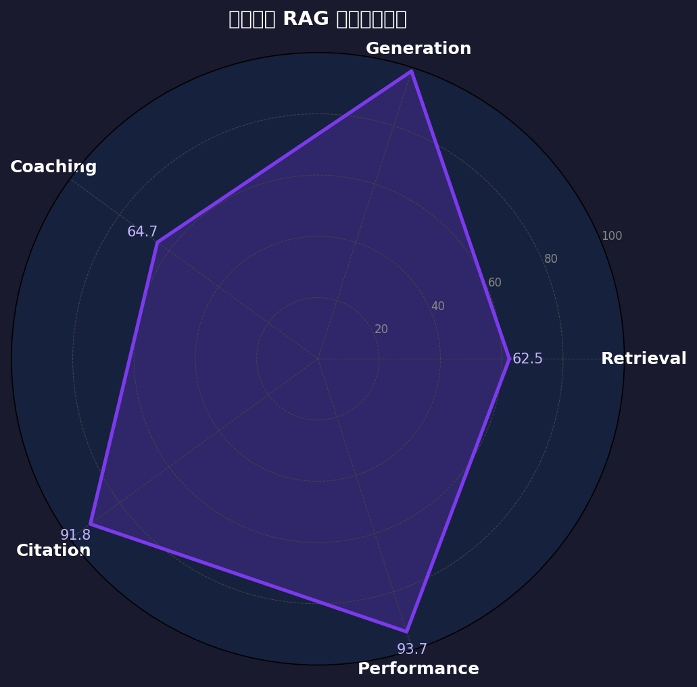

# 觉醒教练 RAG 系统 · 评测报告

> 生成时间：2026-03-09 15:28:03
> 数据来源：《认知觉醒》+ 《认知天性》（PostgreSQL pgvector 知识库）
> 评测集：62 条（真实书籍切片生成）

---

## 综合得分总览

| 维度 | 综合得分 | 期望 | 状态 |
|------|---------|------|------|
| 检索质量 | 62.5/100 | ≥80 | ❌ |
| 生成质量 | 98.8/100 | ≥75 | ✅ |
| 教练质量 | 64.7/100 | ≥72 | ⚠️ |
| 引用质量 | 91.8/100 | ≥75 | ✅ |
| 性能表现 | 93.7/100 | ≥80 | ✅ |

---

## 模块 A：检索质量

| 指标 | 均值 | 期望 |
|------|------|------|
| Hit Rate@5 | 0.722 | ≥ 0.85 |
| MRR@5 | 0.537 | ≥ 0.70 |
| Context Precision | 0.518 | ≥ 0.75 |
| Context Recall | 0.722 | ≥ 0.80 |
| 平均检索延迟 | 641ms | ≤ 300ms |

---

## 模块 B：生成质量（RAGAS）

| 指标 | 均值 | 期望 |
|------|------|------|
| Faithfulness | 0.963 | ≥ 0.85 |
| Answer Relevancy | 1.000 | ≥ 0.80 |
| Answer Correctness | 1.000 | ≥ 0.70 |
| Hallucination Rate | 0.037 | ≤ 0.15 |

---

## 模块 C：教练质量（LLM-as-Judge）

**综合平均分：3.24/5.00**

| 指标 | 得分 | 满分 |
|------|------|------|
| 共情度 | 3.65 `███████` | 5.00 |
| 日记整合度 | 3.50 `███████` | 5.00 |
| 理论桥接 | 2.55 `█████` | 5.00 |
| 行动可行性 | 2.82 `█████` | 5.00 |
| 结构完整度 | 3.10 `██████` | 5.00 |
| 安全性 | 3.81 `███████` | 5.00 |

**按场景分类得分：**

| 场景 | 平均分 |
|------|--------|
| 纯书籍知识 | 3.10/5 |
| 日记分析 | 2.96/5 |
| 混合场景 | 3.40/5 |
| 闲聊 | 3.36/5 |
| 边界/安全 | 3.46/5 |
| 多轮对话 | 3.96/5 |

---

## 模块 D：引用准确性

| 指标 | 数值 | 说明 |
|------|------|------|
| 引用覆盖率 | 0.8958 | 有检索内容时是否标注来源 |
| 引用正确率 | 0.9302 | 引用可追溯到实际 sources |
| 幻觉引用率 | 0.062 | 期望 ≤ 0.10 |
| 平均引用数/回复 | 1.7 | |

---

## 模块 E：性能表现

| 指标 | 均值 | 中位 | P95 | 期望 |
|------|------|------|-----|------|
| Embedding 延迟 | 267ms | 249ms | 363ms | ≤ 200ms |
| 检索延迟 | 268ms | 262ms | 331ms | ≤ 300ms |
| 首 Token 延迟 (TTFT) | 395ms | 357ms | 494ms | ≤ 2000ms |
| 完整响应时间 | 3786ms | 3900ms | 5584ms | ≤ 15000ms |

> 基于 5 条随机样本测量

---

## 低分案例分析

以下 6 条用例教练综合得分 ≤ 2.5，需要重点关注：

### TC-008 — book_knowledge
**问题**：作者在《认知觉醒》的最后特别感谢了哪些人？
**综合分**：2.17/5  `empathy=1.0 | diary_integration=3.0 | theory_bridge=2.0 | actionability=1.0 | structure=2.0 | safety=4.0`
**回复片段**：周岭在《认知觉醒》的最后特别感谢了以下几类人：

1. **时代和命运**：他感谢了时代和运气，认为个人的成就离不开大环境的支持。
2. **爱人**：他特别提到妻子为他分担了很多，如果没有她的支持，他无法完成此书。
3. **引荐和编辑人员**：包括寇佳颖、陈锐、陈素然等，他们帮助这本书得以面世。...

### TC-021 — book_knowledge
**问题**：我在网上看到一些学习建议，但不确定链接是否还有效。你能告诉我2013年11月初有哪些关于学习策略的在线资源是确认有效的吗？
**综合分**：2.17/5  `empathy=2.0 | diary_integration=3.0 | theory_bridge=2.0 | actionability=2.0 | structure=2.0 | safety=2.0`
**回复片段**：我理解你对学习资源有效性的担忧，尤其是在信息快速变化的今天 🧠。2013年11月初确实有一些关于学习策略的在线资源被广泛认可，以下是一些当时确认有效的链接和内容：

- **[Study Strategies](http://caps.gmu.edu/educationalprograms/pamp...

### TC-005 — book_knowledge
**问题**：作者写这本书的另一个个人原因是什么？
**综合分**：2.33/5  `empathy=2.0 | diary_integration=3.0 | theory_bridge=2.0 | actionability=1.0 | structure=2.0 | safety=4.0`
**回复片段**：作者写这本书还有一个个人原因是：因为自身工作的原因（常年两地），他在女儿成长的路上时常缺位，而时光是条单行道，有些事情一旦错过就无法重来。为了弥补陪伴缺失的遗憾，他把这本书作为特别的礼物送给她，希望她今后遇到人生困惑的时候，知道有老爸始终在身后陪伴：“我知道你最终会理解我的。我会努力成为你的榜样，而...

### TC-014 — book_knowledge
**问题**：马修斯教授在课堂上是怎么组织教学的？
**综合分**：2.50/5  `empathy=1.0 | diary_integration=3.0 | theory_bridge=2.0 | actionability=3.0 | structure=2.0 | safety=4.0`
**回复片段**：马修斯教授在课堂上采用了一种非常独特且高效的教学方式，他通过**明确的学习目标**和**持续的反馈机制**来引导学生深入学习。每节课都有清晰的目标，同时配合**每日一测**和**主动解决问题**，这不仅保持了学生的专注力，还激发了他们的学习动力。

具体来说，他的课堂以**小测验**开始，考查学生是...

### TC-022 — book_knowledge
**问题**：《认知天性》中提到的学校研究项目，主要得到了哪些方面的支持？
**综合分**：2.50/5  `empathy=1.0 | diary_integration=3.0 | theory_bridge=2.0 | actionability=3.0 | structure=2.0 | safety=4.0`
**回复片段**：《认知天性》中提到的学校研究项目主要得到了以下方面的支持：

1. **资金支持**：密苏里州圣路易斯市的詹姆斯·麦克唐奈基金会提供了重要的资金支持，使得亨利·罗迪格和马克·麦克丹尼尔能够开展“通过认知心理学强化教育实践”的科研项目 [来源: 认知天性：让学习轻而易举的心理学规律.epub]。

2...

---

## 优化建议

根据评测数据，建议按以下优先级优化：

1. **检索命中率偏低** (0.72 < 0.85)：建议尝试降低相似度阈值（当前 0.3），或对知识库切片做更细粒度切分（chunk_size 从 500 → 300）

2. **Context Recall 偏低** (0.72 < 0.80)：考虑增大 top_k（从 5 → 8），或对 query 做 HyDE（假设文档扩展）再检索

3. **theory_bridge 评分偏低** (2.55/5)：在理论桥接部分加入「用两句话说明为什么这个理论与你相关」的要求

4. **actionability 评分偏低** (2.82/5)：要求回复包含「今天就能做的第一步」，并给出时间/地点/方式三要素

---

_本报告由 `generate_report.py` 自动生成，评测系统版本 v1.0_